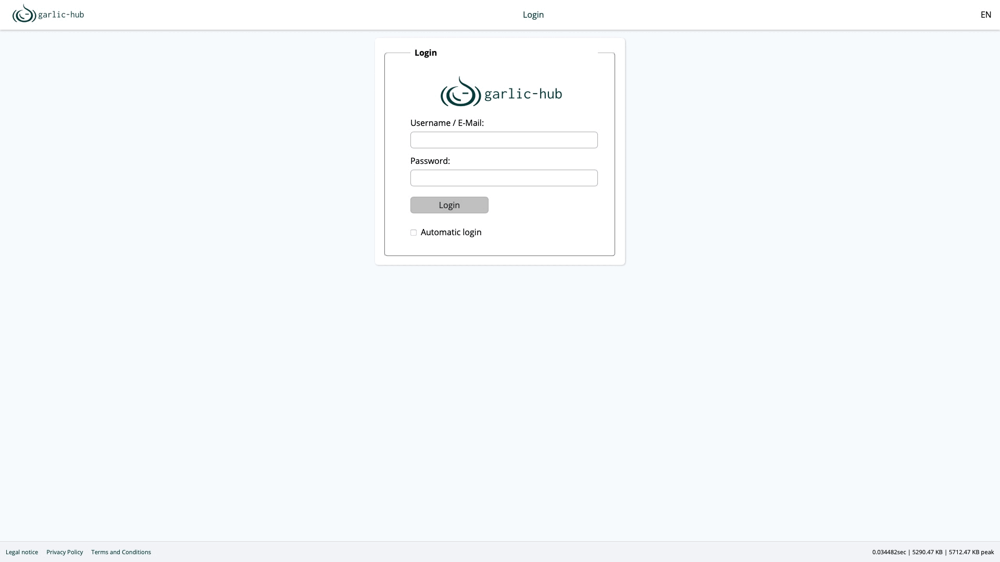

# Garlic-Hub: Smart Digital Signage Management

Garlic-Hub is a comprehensive Digital Signage Management solution that handles core CMS tasks alongside device management. From single-screen setups to distributed networks, it provides centralized control with flexibility for various signage environments.

> **Note**: Garlic-Hub is under active development. This version is intended for evaluation and testing purposes. For production use, we recommend closely monitoring progress and providing feedback.
> 
> Current works:
> - towards PHPStan Level 8 Compliance
> - Simple User Management. Admin should create user tokenized to let them set their own passwords.

## Quick Start

- [User Installation Guide](docs/how-tos/install-user.md)
- [Connecting Media Players](docs/how-tos/connect-mediaplayer-user.md)

## Project Overview

### Edition Roadmap

Garlic-Hub is being developed in three phases, each delivering a distinct edition:

| Edition                  | Target Environment                 | Key Features                                                             | Status                  |
|--------------------------|------------------------------------|--------------------------------------------------------------------------|-------------------------|
| **Edge** (Phase 1)       | Single-device or small deployments | Basic media management, SMIL playlist creation, lightweight architecture | ✅ MVP ready, in testing |
| **Core** (Phase 2)       | Mid-sized networks, NAS            | Limited device management, enhanced content creation                     | 🔄 Planned              |
| **Enterprise** (Phase 3) | Large-scale networks               | SaaS/on-premise, role-based permissions, advanced analytics              | 🔄 Planned              |

Each edition builds upon previous features, ensuring a smooth upgrade path as Garlic-Hub evolves into a comprehensive, SMIL-based digital signage solution.

### Current Features (Edge Edition)
| Section                  | Status | description                                                                                                                            |
|--------------------------|--------|----------------------------------------------------------------------------------------------------------------------------------------|
| **Core Framework**       | ✅      | Database, migrations, logging, routing, middleware and error handling with SLIM 4                                                      |
| **Authentication**       | ✅      | Session-based login with remember-me functionality and basic OAuth2 token authorization                                                |
| **Media Management**     | ✅      | Hierarchical content organization with multi-source uploads (local, external links, screencasts, camera, stock platforms with API-key) |
| **SMIL Playlists**       | ✅      | Playlist management and export in industry-standard SMIL format                                                                        |
| **Multi-Zone Content**   | ✅      | Graphic display zone editor                                                                                                            |
| **Local Player Support** | ✅      | Integration with one local media player                                                                                                |
| **Internationalization** | ✅      | Locale-specific configurations and adaptable UI (English complete, German complete)                                                    |

### Coming Soon
- Online documentation
- Trigger based on time, events, touch, keys, and network
- Conditional play
- last device connection (in work)
- Device management for remote configuration and monitoring
- Real-time reporting and system health monitoring
- Image templating engine
- Raspberry Pi Player / CMS Bundle
- Modern design
- Scalable deployment options
- add multimple languages
## Technical Details

### Stack
- PHP 8.3
- SLIM 4 Framework
- Vanilla JavaScript with some external libs support
- Selected composer libraries
- PHPUnit 11 (targeting >95% test coverage)
- no vibe coding!

### Developer Documentation
- [Coding Standards](docs/coding-standards.md)
- [Installation](docs/install.md)
- [Exceptions](docs/exceptions.md)
- [DI-Container](docs/di-container.md)
- [CLI.php - Command Line Interface](docs/cli.md)
- [Api/Oauth2 - API and Oauth2](docs/oauth2.md)
- [User- Administration](docs/user-administration.md)
- [Connect Media Player](docs/connect-media-player.md)

# Contributing
Contributions are highly encouraged. As the project is in early development, please note that code, features, and documentation are subject to change as we evolve toward a production-ready state.

# License
Garlic-Hub is open-source software licensed under the [Affero GPL v3.0 License](https://www.gnu.org/licenses/agpl-3.0.en.html).
